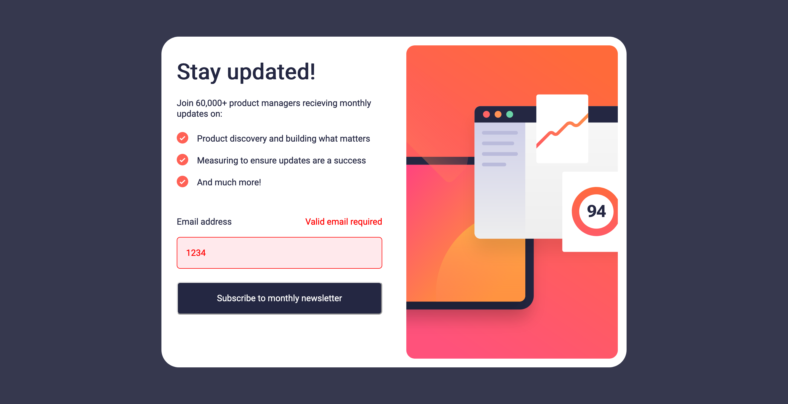
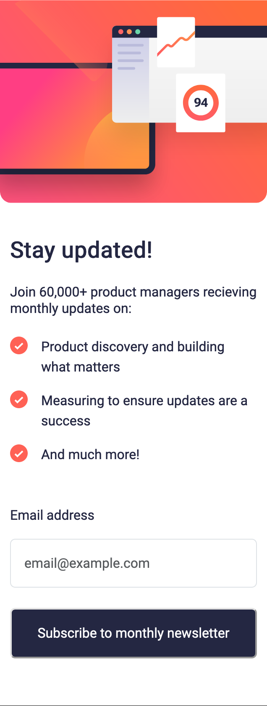

# Frontend Mentor - Newsletter sign-up form with success message solution

This is a solution to the [Newsletter sign-up form with success message challenge on Frontend Mentor](https://www.frontendmentor.io/challenges/newsletter-signup-form-with-success-message-3FC1AZbNrv). This project is meant to build my skills with basic form structure, validation, and submission. The success state is also be an excellent opportunity to work with DOM manipulation.

## Table of contents

- [Overview](#overview)
  - [The challenge](#the-challenge)
  - [Screenshot](#screenshot)
  - [Links](#links)
- [My process](#my-process)
  - [Built with](#built-with)
  - [What I learned](#what-i-learned)
  - [Continued development](#continued-development)
  - [Useful resources](#useful-resources)
- [Author](#author)

## Overview

Utilizing Angular, TypeScript, and Bootstrap, I developed a newsletter sign-up form with email validation, seamlessly transitioning to a success state upon accurate input. Error handling mechanisms promptly alert users to incorrect entries, ensuring a smooth and intuitive sign-up experience.

### Features

Users should be able to:

- Add their email and submit the form
- See a success message with their email after successfully submitting the form
- See form validation messages if:
  - The field is left empty
  - The email address is not formatted correctly
- View the optimal layout for the interface depending on their device's screen size
- See hover and focus states for all interactive elements on the page

### Screenshot

| Normal State: Desktop | Success State: Desktop |
|:---------:|:---------:|
|  |  |

| Active State: Submit button | Active State: Input |
|:---------:|:---------:|
|  |  |

| Error State: No Input | Error State: Wrong Input |
|:---------:|:---------:|
|  |  |

| Normal State: Mobile | Success State: Mobile |
|:---------:|:---------:|
|  |  |

### Links

- Solution URL: [Newsletter sign up - Github](https://github.com/JoanaMamley/frontendmentor-newsletter-sign-up)
- Live Site URL (Soon): [Add live site URL here](https://your-live-site-url.com)

## My process

### Built with

- [Angular](https://angular.io/) - JS library
- [Bootsrap](https://getbootstrap.com/docs/5.0/getting-started/introduction/) - For styles
- CSS custom properties
- Flexbox
- Typescript
- Mobile-first workflow

### What I learned

- Advanced understanding of form validation in Angular, refining techniques for ensuring data accuracy and enhancing user experience.
- Proficiency in crafting responsive websites with Angular, utilizing flexible layouts and components to adapt to various screen sizes and devices.
- Improved skills in managing sign-up and success states through DOM manipulation, enabling the creation of dynamic and intuitive user interfaces.

### Continued development

- Implement Testing Suite: Introduce comprehensive unit and integration tests for the project, ensuring robustness and reliability in    functionality across various scenarios.

- Deployment Automation: Implement CI/CD pipelines to automate the deployment process, facilitating seamless updates and ensuring the latest features are readily accessible to users.

### Useful resources

- [angular.io](https://angular.io/docs) - I followed the documentation for angular to implement most of the parts.
- [bootstrap](https://getbootstrap.com/docs/5.0/getting-started/introduction/) - Bootstrap also helped in easier styling of certain parts of the project.

## Author

- Website - [Joana Mamley Teye](https://github.com/JoanaMamley)
- Frontend Mentor - [@JoanaMamley](https://www.frontendmentor.io/profile/JoanaMamley)
- LinkedIn - [@joana-mamley-teye](www.linkedin.com/in/joana-mamley-teye)